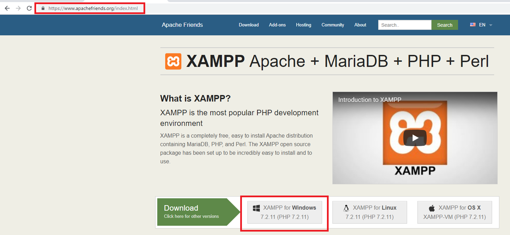
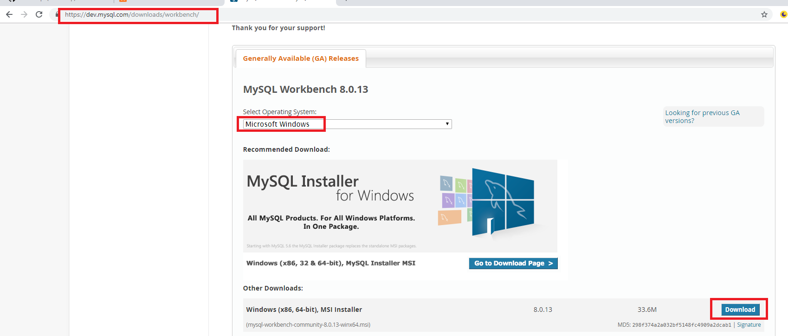
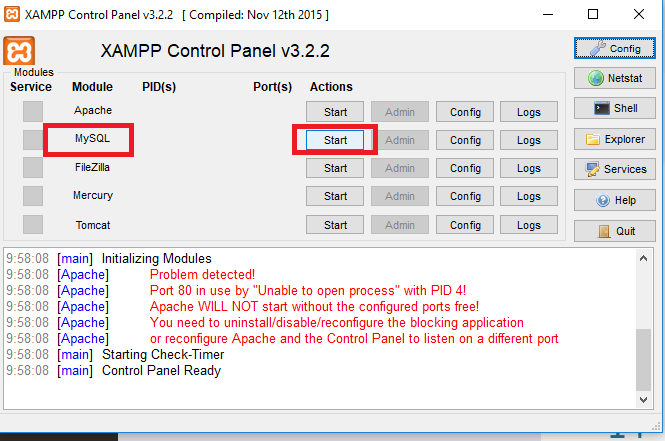
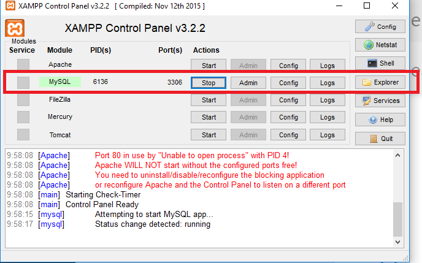
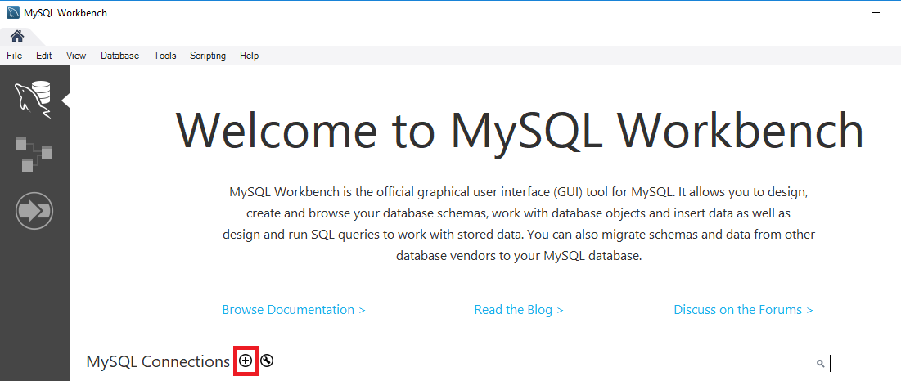
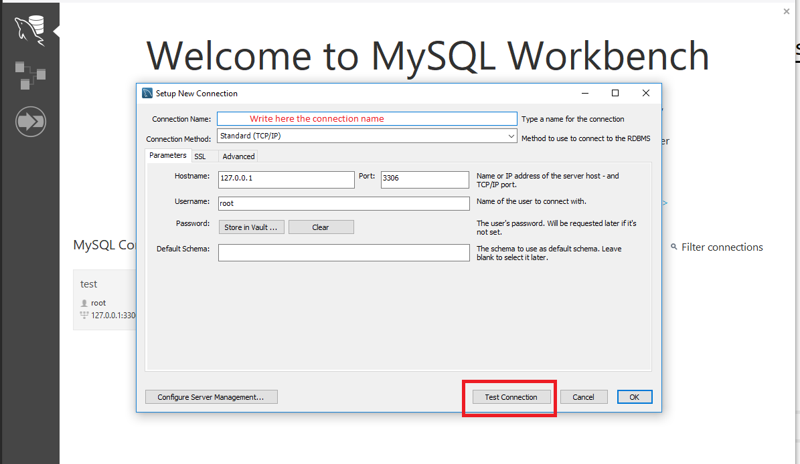
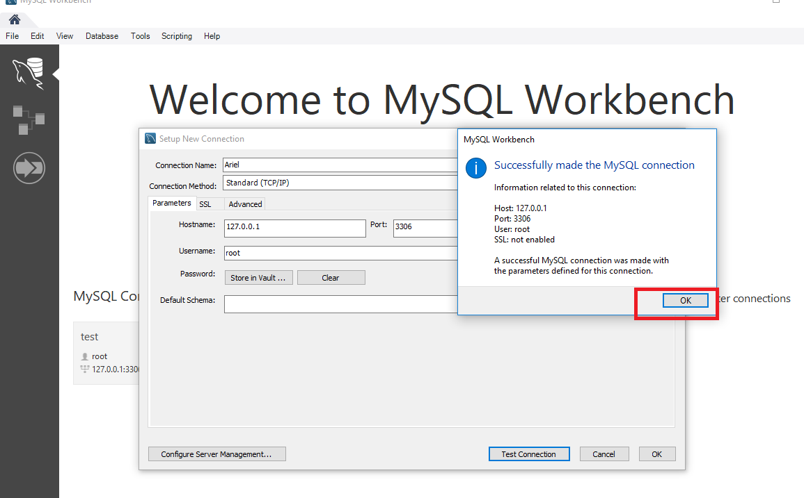
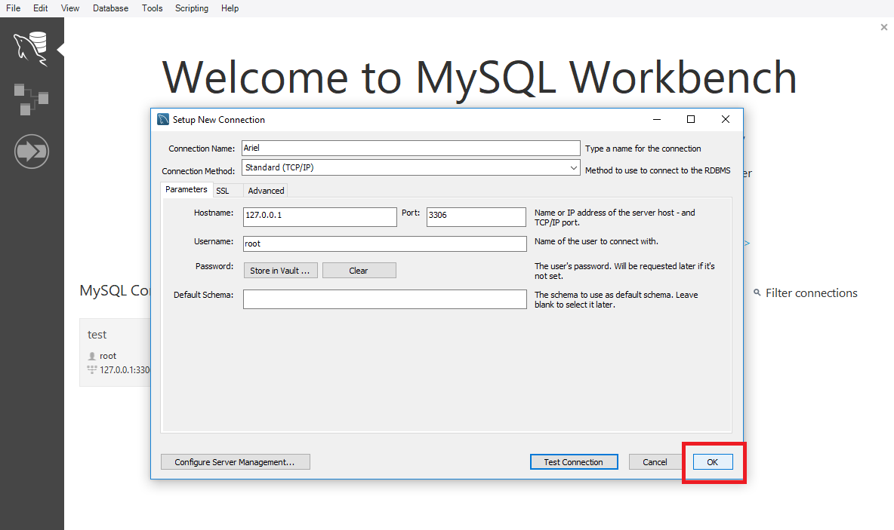
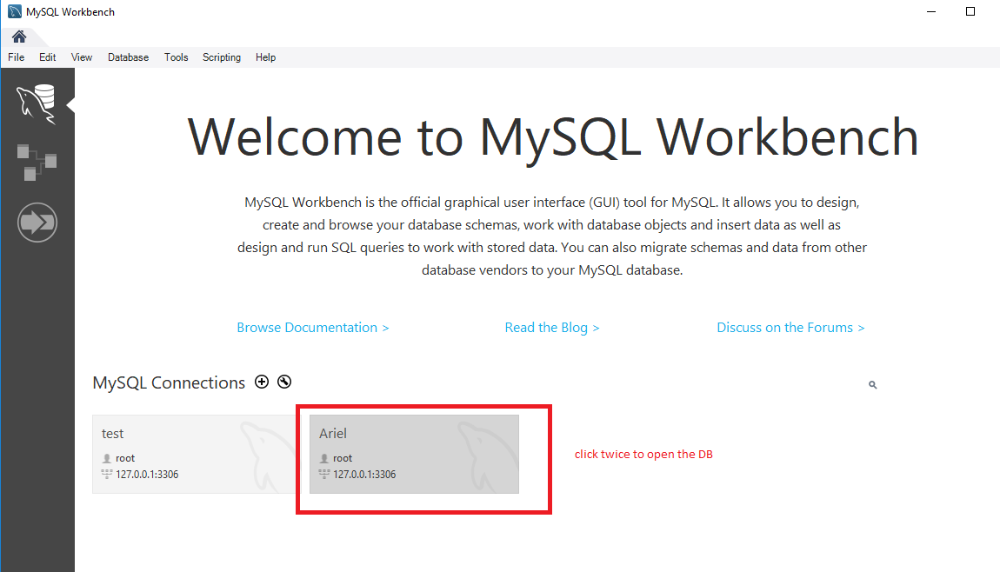

# Install mySql and run (in windows)
* Install `Xampp` (server)   
https://www.apachefriends.org/index.html   

   
   
Then run the app.

* Install `workbench` (gui for mySql)   

https://dev.mysql.com/downloads/workbench/   

   

Then run the app. 

* Run `mySql` in `Xampp`   
  

* Open `workbench` and connect to `Xampp - mySql`   
  
 
  
  
 
