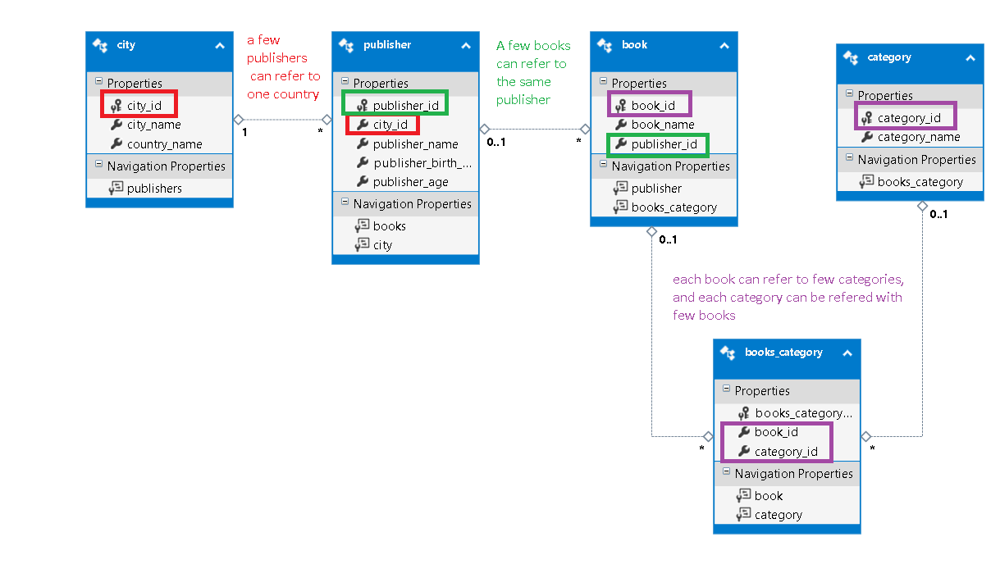
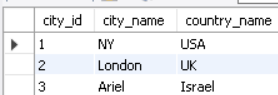
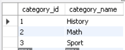
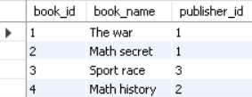
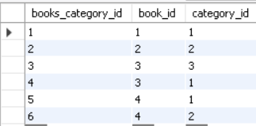
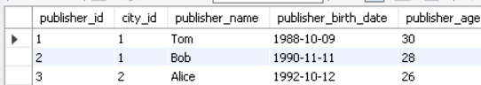
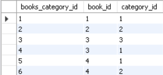
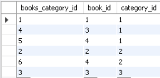
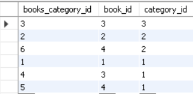
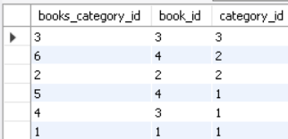

# `BookStore` Data Base

### Database platform
* mySql (server - xampp + client - workbench)


### Commands to create table
* Create the DB
```sql
CREATE DATABASE bookStore;
```


* CREATE TABLE cities
```sql
USE bookStore;
CREATE TABLE cities(

city_id 	    	int(3) AUTO_INCREMENT PRIMARY KEY,

city_name 	    	varchar(25),

country_name  		varchar(25)  NOT NULL CHECK (country_name IN ('USA','UK','Israel'))

);

```


* CREATE TABLE publisher (contains FK to cities table)
```sql
USE bookStore;
CREATE TABLE  publishers(

publisher_id 				int(3) NOT NULL AUTO_INCREMENT,

city_id 				int(3) NOT NULL,

publisher_name 	    			varchar(50) NOT NULL UNIQUE ,

publisher_birth_date			date NULL CHECK (publisher_birth_date LIKE '--/--/----'),

publisher_age 				int(3) NOT NULL CHECK(publisher_age>0 AND publisher_age<120),

PRIMARY KEY (publisher_id),

FOREIGN KEY (city_id) REFERENCES cities(city_id)

);


```


* CREATE TABLE categories
```sql
USE bookStore;

CREATE TABLE categories(

category_id 	int(3) AUTO_INCREMENT PRIMARY KEY,

category_name 	varchar(25)

);

```

* CREATE TABLE books
```sql
USE bookStore;

CREATE TABLE books(

book_id 	int(3) AUTO_INCREMENT PRIMARY KEY,

book_name 	varchar(25),

publisher_id	int(3) ,

FOREIGN KEY (publisher_id) REFERENCES publishers(publisher_id)

);

```


* CREATE TABLE books
```sql
USE bookStore;
CREATE TABLE books_category(

books_category_id 	    int(3) AUTO_INCREMENT PRIMARY KEY,

book_id	    	int(3) ,

category_id	int(3) ,

FOREIGN KEY (book_id) REFERENCES books(book_id),

FOREIGN KEY (category_id) REFERENCES categories(category_id)
);

```

***
### DataBase diagram:

  

***

### Commands to insert new rows in the tables 
* Insert 3 new records to cities table
```sql
USE bookStore;


INSERT INTO `bookstore`.`cities`

(`city_name`,`country_name`)

VALUES
('NY','USA');

INSERT INTO `bookstore`.`cities`

(`city_name`,`country_name`)

VALUES
('London','UK');


INSERT INTO `bookstore`.`cities`

(`city_name`,`country_name`)

VALUES
('Ariel','Israel');

```
 


* Insert 3 new records to publishers table
```sql
USE bookStore;


INSERT INTO `bookstore`.`publishers`
(`city_id`,
`publisher_name`,
`publisher_birth_date`,
`publisher_age`)
VALUES(
1,
'Tom',
'0000-00-00',
28);


INSERT INTO `bookstore`.`publishers`
(`city_id`,
`publisher_name`,
`publisher_birth_date`,
`publisher_age`)
VALUES(
1,
'Bob',
'1990-11-11',
'28');

INSERT INTO `bookstore`.`publishers`
(`city_id`,
`publisher_name`,
`publisher_birth_date`,
`publisher_age`)
VALUES (
 2,
'Alice',
'1992-10-12',
26);
```
 


* Insert 3 new records to categories table
```sql
USE bookStore;


INSERT INTO `bookstore`.`categories`
(`category_name`)
VALUES
('History');

INSERT INTO `bookstore`.`categories`
(`category_name`)
VALUES
('Math');

INSERT INTO `bookstore`.`categories`
(`category_name`)
VALUES
('Sport');

```



* Insert 4 new records to books table
```sql
USE bookStore;

INSERT INTO `bookstore`.`books`
(`book_name`,
`publisher_id`)
VALUES
('The war',1);

INSERT INTO `bookstore`.`books`
(`book_name`,
`publisher_id`)
VALUES
('Math secret',1);

INSERT INTO `bookstore`.`books`
(`book_name`,
`publisher_id`)
VALUES
('Sport race',3);

INSERT INTO `bookstore`.`books`
(`book_name`,
`publisher_id`)
VALUES
('Math history',2);
``` 


* Insert 6 new records to books_category table
```sql
USE bookStore;


INSERT INTO `bookstore`.`books_category`
(`book_id`,`category_id`)
VALUES (1,1);


INSERT INTO `bookstore`.`books_category`
(`book_id`,`category_id`)
VALUES (2,2);


INSERT INTO `bookstore`.`books_category`
(`book_id`,`category_id`)
VALUES (3,3);

INSERT INTO `bookstore`.`books_category`
(`book_id`,`category_id`)
VALUES (3,1);

INSERT INTO `bookstore`.`books_category`
(`book_id`,`category_id`)
VALUES (4,1);

INSERT INTO `bookstore`.`books_category`
(`book_id`,`category_id`)
VALUES (4,2);


```



***
### Commands to update rows in the tables 

* Update the publisher details with id 1 to:  `publisher_birth_date` = '1988-10-09' and `publisher_age` = 30 
```SQL
UPDATE `bookstore`.`publishers`
SET
`publisher_birth_date` = '1988-10-09',
`publisher_age` = 30 
WHERE `publisher_id` = 1;
```


Befor command the publishers table was:   

    

After change publishers table is:   

 


***
### Select commands
* Select all rows from publisher table
```sql
USE bookStore;

SELECT * FROM publishers;
```

 


* Select only publisher_name and publisher_age from publishers table
```sql
USE bookStore;
SELECT publisher_name , publisher_age FROM publishers;
```
 


* Select only publisher_name and publisher_age from publishers table, only where publisher_age is between 27 to 30
```sql
USE bookStore;

SELECT publisher_name , publisher_age 
FROM publishers
WHERE publisher_age>27 AND publisher_age<30;
```
 

* Select only publisher_name and publisher_age from publishers table, ordered by the age (from low to high)
```sql
USE bookStore;

SELECT publisher_name , publisher_age 
FROM publishers
ORDER BY publisher_age;

```
 


* select all rows from books_category table
```sql
USE bookStore;

SELECT *
FROM books_category
```


* select all rows from books_category table, ordered by the book_id (from low to high)
```sql
USE bookStore;

SELECT *
FROM books_category
ORDER BY book_id
```



* select all rows from books_category table, ordered by the category_id (from low to high)
```sql
USE bookStore;

SELECT *
FROM books_category
ORDER BY category_id 
```



* select all rows from books_category table, ordered by the category_id (from high to low) 
```sql
USE bookStore;

SELECT *
FROM books_category
ORDER BY category_id DESC
```



* select all rows from books_category table, ordered by the category_id and book_id (from high to low) 
```sql
USE bookStore;

SELECT *
FROM books_category
ORDER BY category_id DESC, book_id DESC
```

