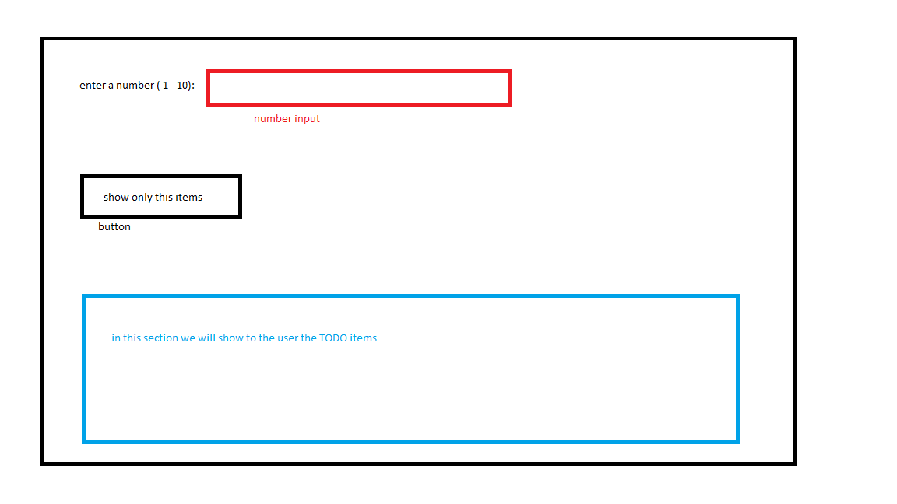

# Class task
* Given the following TODO list:
```json
[
  {
    "userId": 1,
    "id": 1,
    "title": "delectus aut autem",
    "completed": false
  },
  {
    "userId": 1,
    "id": 2,
    "title": "quis ut nam facilis et officia qui",
    "completed": false
  },
  {
    "userId": 1,
    "id": 3,
    "title": "fugiat veniam minus",
    "completed": false
  },
  {
    "userId": 1,
    "id": 4,
    "title": "et porro tempora",
    "completed": true
  },
  {
    "userId": 1,
    "id": 5,
    "title": "laboriosam mollitia et enim quasi adipisci quia provident illum",
    "completed": false
  },
  {
    "userId": 1,
    "id": 6,
    "title": "qui ullam ratione quibusdam voluptatem quia omnis",
    "completed": false
  },
  {
    "userId": 1,
    "id": 7,
    "title": "illo expedita consequatur quia in",
    "completed": false
  },
  {
    "userId": 1,
    "id": 8,
    "title": "quo adipisci enim quam ut ab",
    "completed": true
  },
  {
    "userId": 1,
    "id": 9,
    "title": "molestiae perspiciatis ipsa",
    "completed": false
  },
  {
    "userId": 1,
    "id": 10,
    "title": "illo est ratione doloremque quia maiores aut",
    "completed": true
  },
  ```
* Create a new angular app
* In the app - add a matching interface to the given list
* In the `app-component` add to the htnl a preview of all the TODO's items
* Add to the `app-component` an input tag (with `number` type)
* The default value of this input tag - will be the length of the TODO list (10 elements)
* When the user clicks on the "show only this items"  button - the preview of all the TODO's items will show only the first items (according to the user's input)
* Use this mockup:   
<br/>

