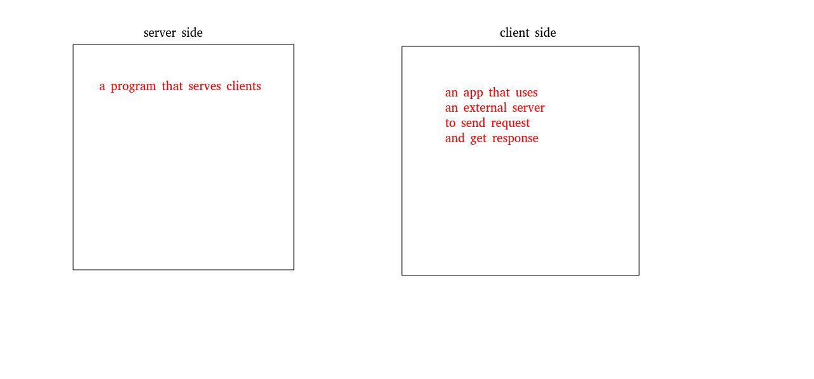
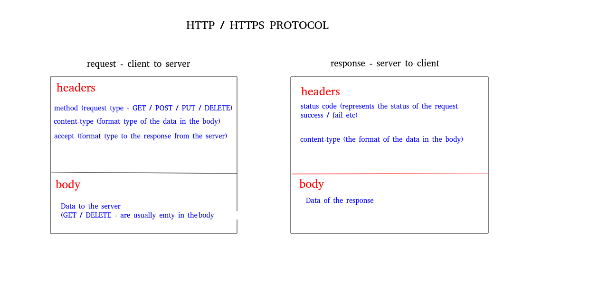
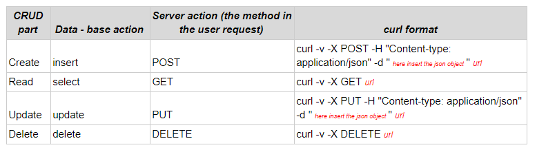

# Tiers of generic app:
* Database (can be `sql` or `no-sql`)
* Server (uses the db and serves the data to the client)
* client

# Server VS Client


# REQUEST And Respomse
* `C` - CREATE - POST
* `R` - READ - GET
* `U` - UPDATE - PUT
* `D` - DELETE -DELETE


### Curl basic commands:



# CURL
###### Server: https://reqres.in/
###### Client (curl)
---


#### GET REQUEST
```bash
curl -X GET -v https://reqres.in/api/users?page=2
```

Request headers:
```bash
> GET /api/users?page=2 HTTP/2
> Host: reqres.in
> User-Agent: curl/7.58.0
> Accept: */*
```

Response headers:
```bash
< HTTP/2 200 
< content-type: application/json; charset=utf-8
```

Response body:
```json
{
    "page": 2,
    "per_page": 3,
    "total": 12,
    "total_pages": 4,
    "data": [
        {
            "id": 4,
            "first_name": "Eve",
            "last_name": "Holt",
            "avatar": "https://s3.amazonaws.com/uifaces/faces/twitter/marcoramires/128.jpg"
        },
        {
            "id": 5,
            "first_name": "Charles",
            "last_name": "Morris",
            "avatar": "https://s3.amazonaws.com/uifaces/faces/twitter/stephenmoon/128.jpg"
        },
        {
            "id": 6,
            "first_name": "Tracey",
            "last_name": "Ramos",
            "avatar": "https://s3.amazonaws.com/uifaces/faces/twitter/bigmancho/128.jpg"
        }
    ]
}
```


#### POST REQUEST

```bash
curl -v -X POST -H "Content-type: application/json" -d "{\"name\":\"morpheus\", \"job\":\"leader\" }"  https://reqres.in/api/users
```

Request headers:
```bash
POST /api/users HTTP/2
> Host: reqres.in
> User-Agent: curl/7.58.0
> Accept: */*
> Content-type: application/json
> Content-Length: 36
```

Response headers:
```bash
< HTTP/2 201 
< date: Wed, 01 Aug 2018 16:22:10 GMT
< content-type: application/json; charset=utf-8
```

Response body:
```json
{
    "name": "morpheus",
    "job": "leader",
    "id": "241",
    "createdAt": "2018-08-01T16:23:47.894Z"
}
```


#### PUT REQUEST

```bash
curl -v -X PUT -H "Content-type: application/json" -d "{\"name\":\"morpheus\", \"job\":\"leader\" }"  https://reqres.in/api/users/2
```

Request headers:
```bash
> PUT /api/users/2 HTTP/2
> Host: reqres.in
> User-Agent: curl/7.58.0
> Accept: */*
> Content-type: application/json
> Content-Length: 36
```

Response headers:
```bash
< HTTP/2 200 
< content-type: application/json; charset=utf-8
```

Response body:
```json
{
    "name": "morpheus",
    "job": "leader",
    "updatedAt": "2018-08-01T16:25:43.842Z"
}
```


#### DELETE REQUEST

```bash
curl -v -X DELETE https://reqres.in/api/users/2
```

Request headers:
```bash
> DELETE /api/users/2 HTTP/2
> Host: reqres.in
> User-Agent: curl/7.58.0
> Accept: */*
```

Response headers:
```bash
< HTTP/2 204 
```

